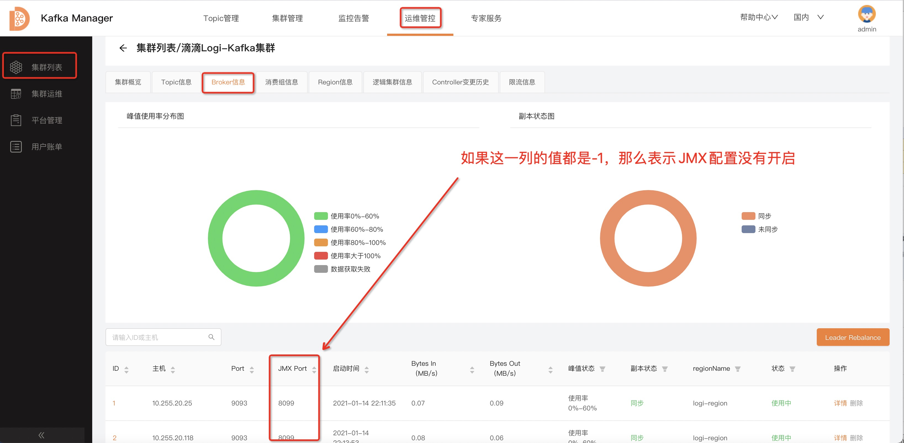

---


**一站式`Apache Kafka`集群指标监控与运维管控平台**

--- 

## JMX-连接失败问题解决

集群正常接入Logi-KafkaManager之后，即可以看到集群的Broker列表，此时如果查看不了Topic的实时流量，或者是Broker的实时流量信息时，那么大概率就是JMX连接的问题了。

下面我们按照步骤来一步一步的检查。

### 1、问题&说明

**类型一：JMX配置未开启**

未开启时，直接到`2、解决方法`查看如何开启即可。




**类型二：配置错误**

`JMX`端口已经开启的情况下，有的时候开启的配置不正确，此时也会导致出现连接失败的问题。这里大概列举几种原因：

- `JMX`配置错误：见`2、解决方法`。
- 存在防火墙或者网络限制：网络通的另外一台机器`telnet`试一下看是否可以连接上。
- 需要进行用户名及密码的认证：见`3、解决方法 —— 认证的JMX`。
- 当logikm和kafka不在同一台机器上时,kafka的Jmx端口不允许其他机器访问:见`4、解决方法`。


错误日志例子：
```
# 错误一： 错误提示的是真实的IP，这样的话基本就是JMX配置的有问题了。
2021-01-27 10:06:20.730 ERROR 50901 --- [ics-Thread-1-62] c.x.k.m.c.utils.jmx.JmxConnectorWrap     : JMX connect exception, host:192.168.0.1 port:9999.
java.rmi.ConnectException: Connection refused to host: 192.168.0.1; nested exception is: 


# 错误二：错误提示的是127.0.0.1这个IP，这个是机器的hostname配置的可能有问题。
2021-01-27 10:06:20.730 ERROR 50901 --- [ics-Thread-1-62] c.x.k.m.c.utils.jmx.JmxConnectorWrap     : JMX connect exception, host:127.0.0.1 port:9999.
java.rmi.ConnectException: Connection refused to host: 127.0.0.1;; nested exception is: 
```

### 2、解决方法

这里仅介绍一下比较通用的解决方式，如若有更好的方式，欢迎大家指导告知一下。

修改`kafka-server-start.sh`文件：
```
# 在这个下面增加JMX端口的配置
if [ "x$KAFKA_HEAP_OPTS" = "x" ]; then
    export KAFKA_HEAP_OPTS="-Xmx1G -Xms1G"
    export JMX_PORT=9999  # 增加这个配置, 这里的数值并不一定是要9999
fi
```

&nbsp;

修改`kafka-run-class.sh`文件
```
# JMX settings
if [ -z "$KAFKA_JMX_OPTS" ]; then
  KAFKA_JMX_OPTS="-Dcom.sun.management.jmxremote -Dcom.sun.management.jmxremote.authenticate=false  -Dcom.sun.management.jmxremote.ssl=false -Djava.rmi.server.hostname=${当前机器的IP}"
fi

# JMX port to use
if [  $JMX_PORT ]; then
  KAFKA_JMX_OPTS="$KAFKA_JMX_OPTS -Dcom.sun.management.jmxremote.port=$JMX_PORT -Dcom.sun.management.jmxremote.rmi.port=$JMX_PORT"
fi
```


### 3、解决方法 —— 认证的JMX

如果您是直接看的这个部分，建议先看一下上一节：`2、解决方法`以确保`JMX`的配置没有问题了。

在JMX的配置等都没有问题的情况下，如果是因为认证的原因导致连接不了的，此时可以使用下面介绍的方法进行解决。

**当前这块后端刚刚开发完成，可能还不够完善，有问题随时沟通。**

`Logi-KafkaManager 2.2.0+`之后的版本后端已经支持`JMX`认证方式的连接，但是还没有界面，此时我们可以往`cluster`表的`jmx_properties`字段写入`JMX`的认证信息。

这个数据是`json`格式的字符串，例子如下所示：

```json
{
    "maxConn": 10,           # KM对单台Broker的最大JMX连接数
    "username": "xxxxx",     # 用户名
    "password": "xxxx",      # 密码
    "openSSL": true,         # 开启SSL, true表示开启ssl, false表示关闭
}
```

&nbsp;

SQL的例子：
```sql
UPDATE cluster SET jmx_properties='{ "maxConn": 10,	"username": "xxxxx", "password": "xxxx", "openSSL": false }' where id={xxx};
```
### 4、解决方法 —— 不允许其他机器访问

该图中的127.0.0.1表明该端口只允许本机访问.
在cdh中可以点击配置->搜索jmx->寻找broker_java_opts 修改com.sun.management.jmxremote.host和java.rmi.server.hostname为本机ip
