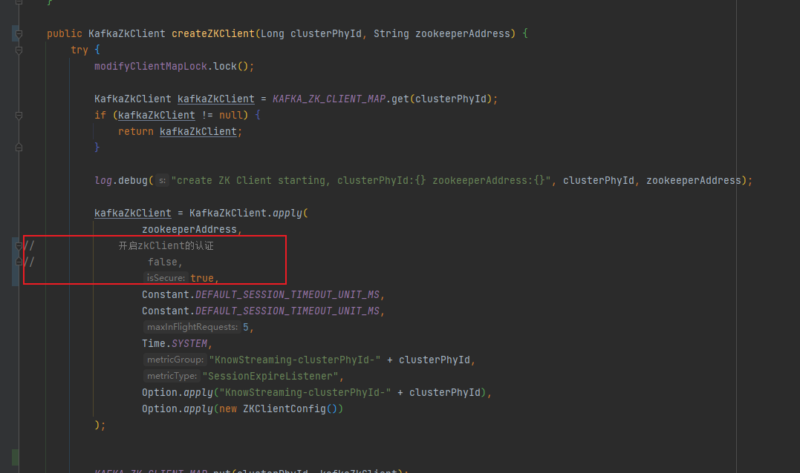
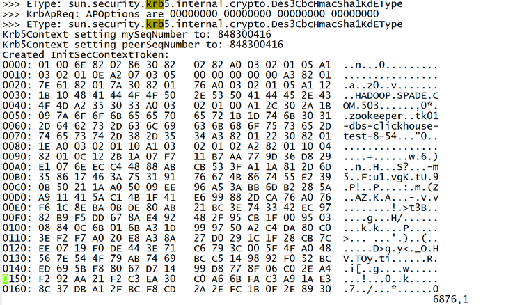

1、需要修改代码:
位置：src/main/java/com/xiaojukeji/know/streaming/km/persistence/kafka/KafkaAdminZKClient.java
将createZKClient的135行的false改为true

修改完之后就可以打包编译：打包编译见：参考2.3 后端单独打包
https://github.com/didi/KnowStreaming/blob/master/docs/install_guide/%E6%BA%90%E7%A0%81%E7%BC%96%E8%AF%91%E6%89%93%E5%8C%85%E6%89%8B%E5%86%8C.md
2、查看kafka的ZK的Acl
首先查看kafka的server.properties的配置的zookeeper.connect的连接,然后使用：zkCli.sh -serve xxxx登录到zk的页面，然后执行命令getAcl /kafka

此时就可以看到kafka在zk中的用户的权限，因为我们的集群在server.properties 配置了super.users=User:kafka ，以及zookeeper.set.acl=true ，默认的kafka的权限就是cdrwa。如果没有用户有cdrwa权限的话，需要zk创建用户并授权，授权命令：setAcl
3、在Kerberos的域中创建 kafka/_HOST的keytab，并导出。例如：kafka/dbs-kafka-test-8-53
4、导出keytab后上传到安装KS的机器的/etc/keytab下。执行 kinit -kt zookeepe.keytab kafka/dbs-kafka-test-8-53  看是否能进行Kerberos登录
5、可以登录后，配置/opt/zookeeper.jass文件：
Client {
com.sun.security.auth.module.Krb5LoginModule required
useKeyTab=true
storeKey=false
serviceName="zookeeper"
keyTab="/etc/keytab/zookeeper.keytab"
principal="kafka/dbs-kafka-test-8-53@XXX.XXX.XXX";
};
6、需要配置KDC-Server对KS的机器开通防火墙，并在KS的机器/etc/host/  配置 kdc-server的hostname。并将 krb5.conf 导入到/etc下
7、在/usr/local/KnowStreaming/KnowStreaming/bin/startup.sh中的47行的JAVA_OPT中追加如下设置：
-Dsun.security.krb5.debug=true -Djava.security.krb5.conf=/etc/krb5.conf -Djava.security.auth.login.config=/opt/zookeeper.jaas
8、重启KS集群后再start.out中看到如下信息，证明Kerberos配置成功

9、对于多集群来说如果用的是一样的Kerberos域的话，只需在每个zk中给kafka用户配置crdwa权限即可，这样集群初始化的时候zkclient是都可以认证。
10、未改进：
    1、需要页面ZK的Kerberos配置化
    2、多个Kerberos域暂时未适配。